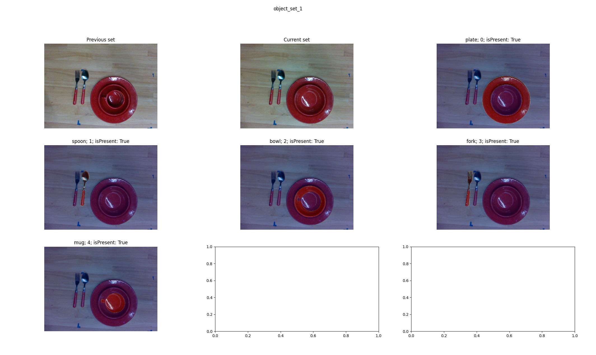
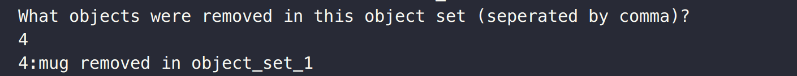

# 6DoF Perception Data Labeler
6DoF perception data labeling tool that can provide data for: object detection, segmentation, 3D shape reconstruction, 6DoF pose estimation etc.

[](https://www.youtube.com/watch?v=wNX_vwQbM0o)

(Click the gif above to see system video)


### Key capabilities:​
- Tool is built as a webapp and hence can be accessed by many labelers simultaneously​
- Multi-view fused point-cloud is used as single-view point-cloud is un-operable due to noise​
- Labelers can get feedback from rendered 2D instance masks and improve their labels​
- Labelers can manipulate object in the world-frame or the frame attached to the object​
- One scene label can provide labels for many calibrated RGB-D views (~260 views in our case)​


# Setting up the tool:
Three steps are required to setup the tool:
- Arrange collected unlabelled real-world data into [specified format](#data-directory-structure)
- [Build the client](#client) (i.e., the tool website)
- [Run the server](#server) (which serves the client we built above)

## Data directory structure
Data directory contains the real-world collected data that needs to be labelled. We also
provide [sample data in outreach/sample_data.zip](outreach/sample_data.zip) that you can
use to try out the tool. Below is the format:

```
gt_meshes/
    gt_meshes.json
    mesh_1.obj
    mesh_2.obj
    ...
scene_0/
    object_set_0/
        lighting_0/
            view_0/
            view_1/
            ...
        lighting_1/
            view_0/
            view_1/
            ...
        ...
    object_set_1/
        lighting_0/
        lighting_1/
        ...
    ...
scene_1/
...
```

`gt_meshes directory` contains `gt_meshes.json` file and mesh files in the obj format.
The gt_meshes.json file is structured as:
```json
[
    {
        "name": "mesh_1_name",
        "path": "mesh_1.obj"
    },
    {
        "name": "mesh_2_name",
        "path": "mesh_2.obj"
    },
    ...
]
```

Each `scene_*` directories correspond to one scene to be labelled. To maximize the number
of datapoints generated per user scene label, we add variations along three dimensions:
- `object_set_*`: we also remove objects without disturbing pose of other objects.
    * i.e., object_set_0 will have the original scene. Object_set_1 will have less objects
     than object_set_0 but the pose of remaining objects is still same as object set 0.
- `lighting_*`: variation in lighting condition without disturbing the scene
- `view_*.pkl`: vary camera pose and record `{rgb, d, camera_k, camera_pose}`

<details>
  <summary>For more details, click here to see the data collection process pseudo-code</summary>

```python
    scene_dir = mkdir(f"scene_{scene_index}")
    object_set_index = 0
    while atleast_one_object_left:
        object_set_dir = mkdir(scene_dir / f"object_set_{object_set_index}")
        for lighting_index in range(num_lightings):
            light_dir = mkdir(object_set_dir / f"lighting_{lighting_index}")
            for view_index, pre_planned_view_pose in enumerate(pre_planned_view_poses):
                move_robot(pre_planned_view_pose)
                view_data = {
                    "rgb": rgb,
                    "depth": depth,
                    "camera_intrinsics": camera_intrinsics,  # 3X3 camera intrinsics
                    "tag_pose": np.linalg.inv(camera_pose_in_robot_frame)  # Homogeneous 4x4 transform
                }
                save_view_data(view_data, f"view_{view_index}.pkl")

        remove_one_or_many_objects_from_the_scene  # without disturbing configuration of other objects
        object_set_index += 1
```

</details>

<br>

**Note**: If you do not have multiple `object_set` or `lighting` variations or even `view` direction variations, just create `object_set_0\lighting_0\view_0.pkl`. Code will still work.


## Client
Export path to `static` build directory and the `static/data` directory. The `static`
build directory path is used by [client](src/client) for saving frontend build files.
The `static/data` directory path is used by [server](src/server) for processing and
serving the data files. To export these paths, run the following:
```
source setup.sh
cd src/client
```

If running first time, install npm via nvm if not already installed:

- 
    ```
    curl -o- https://raw.githubusercontent.com/nvm-sh/nvm/v0.38.0/install.sh | bash
    export NVM_DIR="$([ -z "${XDG_CONFIG_HOME-}" ] && printf %s "${HOME}/.nvm" || printf %s "${XDG_CONFIG_HOME}/nvm")"
    [ -s "$NVM_DIR/nvm.sh" ] && \. "$NVM_DIR/nvm.sh" # This loads nvm

    nvm install 14.17.6
    ```
- Then install npm packages (from inside `src/client`):
    ```
    npm install
    npm install --save-dev webpack --ignore-scripts
    ```

Build the client:
```
npm run build
```

During development, instead of building client every time, you can also use for live building:
```
npm run watch
```

## Server
If running first time, you need to setup the python environment
```
conda env create -f environment.yml
```

Run the server:
```
conda activate data_labeler
source setup.sh
cd src/server
source setup.sh
flask run --host 0.0.0.0
```

# Using the tool:
There are three steps for generating instance masks for unlabelled data:
1. [Label data](#labeling-the-data)
2. [Label the object-sets](#labeling-the-object-sets)
3. [Processing labels to generate instance masks](#processing-labels-to-generate-instance-masks)

## Labeling the data:
Once the server is running, go to browser at url: `http://localhost:5000/?scene=0`
for labeling scene 0. Change `?scene=<scene_index>` part of url to label another scene.

Following are some of the useful labeling UI details:
- On start, you should see a multi-view fused pointcloud in the main window
    * This fused pointcloud load can take upto 30 seconds depending on the number of
        views
- To add a new object to label, select object from drop-down, click on add and then 
    activate object in UI by clicking on the object's radio button


- To activate translation mode: press "w". You can translate objects along standard axes,
    planes or in free space as shown:


- To activate rotation mode: press "e". You can rotate objects along standard axes,
    or in free space as shown:


- You can also manipulate objects in the object frame. To toggle frames between world
    and object frame, press "q".


- To render instance masks, click on `save and render`. This will save labels and render
    instance masks.


- To save, click on `save`. This will save the labels


Saving the scene will generate `static/data/scene_ind/labels_object_set_0__lighting_0__view_3.pkl.json` file which contains the label
information

## Labeling the object-sets:
For every scene, if the data collection process had object-sets, the labeler need to
provide information on what objects were removed between two consecutive object-sets.

For doing this, use the following code:
```sh
conda activate data_labeler
source setup.sh
cd src/
python generate_labels/remove_saved_mask.py
```

For every object-set, this script will open matplotlib window similar to the following:



In the window above, one can compare the previous set and the current set to figure out
what object(s) were removed. They can also see the id of the object removed from 
instance masks labels. In the image above, for example, mug: 4 was removed.

The labeler can then type id(s) of object(s) removed in terminal as shown below



Once done for all sets, this will generate the file `scene_*/labels_object_set_0__lighting_0__view_3_object_set_info.pkl.json`
containing object set information.

## Processing labels to generate instance masks:
Rendering instances masks is slightly compute heavy task and hence we do it as a post-
processing step.

```sh
conda activate data_labeler
source setup.sh
cd src
python generate_labels/interpolate_labels.py
```

For every `view_i.pkl` file, the above script will generate the interpolated masks in `view_i_label_mask.pkl`.

We also provide a utility script to visualize generated labels in html format. To 
visualize:
```sh
conda activate data_labeler
source setup.sh
cd src
python generate_labels/visualize_labels.py
```
This will generate visualizations in the `logs/visualize_labels` directory.


# Acknowledgements:
This tool is based on the teleoperation tool used in the paper [Scene Editing as Teleoperation (SEaT)](https://seat.cs.columbia.edu/) however a complete re-write was
done to cater to our needs.

# Contacts:
For any questions, please reach out to Shubham Agrawal <agshubh191@gmail.com>.
